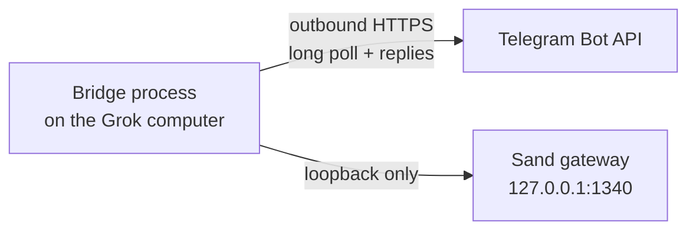

<div align="center">

# Grok Bot ↔ Telegram Bridge

**A self-hosted Telegram gateway for [Grok Bot](https://grok.com)'s remote computer**

[](https://github.com/SSBrouhard/grokbot-telegram-bridge/actions/workflows/ci.yml)
[](https://nodejs.org/)
[](LICENSE)

</div>

> [!NOTE]
> **This is a fork** of [SSBrouhard/grokbot-telegram-bridge](https://github.com/SSBrouhard/grokbot-telegram-bridge), created by the **grokbot-telegram-bridge contributors** (see [LICENSE](LICENSE)) and maintained upstream by [@SSBrouhard](https://github.com/SSBrouhard). Many thanks to the original author for a careful, security-first bridge that made this work possible. The fork keeps the upstream MIT license and copyright notice unchanged. See [What this fork adds](#what-this-fork-adds) and [Fork configuration](#fork-configuration). To install the fork, clone this repository instead of the upstream URL shown under [Install](#install).

> [!IMPORTANT]
> **Unofficial project.** This bridge is not affiliated with, endorsed by, or supported by xAI, Grok, or Telegram.

The bridge runs **inside Grok Bot's remote computer**, long-polls Telegram over outbound HTTPS, and talks to the local Sand gateway on **loopback only**. Your laptop, a public webhook, and Tailscale are not in the message path.

| At a glance | Contract |
| --- | --- |
| **Access** | Private chats matching **both** user and chat allowlists; in this fork, also allowlisted groups and forum supergroups |
| **Network** | Outbound Telegram Bot API + loopback Sand gateway; no inbound ports |
| **Runtime** | Node.js 20.6+ with zero registry dependencies — **no `npm install`** |
| **Delivery** | Durable state with at-least-once delivery semantics |
| **Media** | Text, photos (albums bundled into one turn), voice, audio, video, video notes, and files; 20 MB Bot API cap |

> [!CAUTION]
> If `TELEGRAM_ALLOWED_USER_IDS` or `TELEGRAM_ALLOWED_CHAT_IDS` is wrong, the bot ignores everyone, including you. If `GROK_GATEWAY_URL` is not loopback, the process refuses to start.

**[What this fork adds](#what-this-fork-adds)** · **[Fork configuration](#fork-configuration)** · **[Install](#install)** · **[Security boundary](#security-boundary)** · **[Commands](#telegram-commands)** · **[Desktop mirroring](#desktop-mirroring)** · **[Operations](#operations)** · **[Limitations](#limitations)**

## What this fork adds

In plain language, compared with upstream:

- **Groups and forum topics.** The bot can live in Telegram groups and forum supergroups whose chat ID is in `TELEGRAM_ALLOWED_CHAT_IDS`. Replies go back into the same forum topic. The forum "General" topic (thread id 1) is handled correctly.
- **A hybrid group filter.** In groups the bot always answers mentions, slash commands, replies to its own messages, and (optionally) messages containing configured keywords. Other meaningful messages (text, photos, files, voice notes) are "soft-forwarded" with a short instruction telling the agent to reply only when it should, and to otherwise answer exactly `NO_TELEGRAM_REPLY`, which the bridge turns into silence. Plain chatter such as "ok", "thanks", emoji, stickers, and join/leave notices is dropped before it reaches Grok.
- **Context headers for the agent.** Every prompt starts with `[telegram-from]` (sender id, name, username, and `forwarded=yes` for forwarded messages), `[telegram-chat]` (chat id and type), and, in forums, `[telegram-topic]` (topic id and name). Lines at the start of a user's message that imitate these headers are stripped, so users cannot spoof another sender, chat, or topic.
- **Per-topic agent routing.** `TELEGRAM_TOPIC_AGENTS` sends each forum topic to its own Grok agent, matched by topic id first and then by topic name. Routed topics get their own queue so a slow agent does not block other topics, skip the keyword filter, and cannot be switched with `/use`. If a routed agent is missing, the bridge stays quiet instead of falling back to the default agent.
- **Topic-name learning.** Topic names are learned from Telegram's topic-created/renamed service messages and saved in the state file, so name-based routing and topic headers keep working after a restart.
- **Photo bundling.** An album, or a quick burst of photos from the same person in the same topic, plus the text they send right after, becomes **one** Grok turn with all images attached and an `[photos attached: N]` label, instead of one turn per photo.
- **Voice notes and video notes.** Voice notes are forwarded with an instruction to answer naturally without a `Transcript:` dump (a leading `Transcript:` line is also stripped from replies). Round video notes are forwarded as attachments.
- **More reliable delivery.** Every message the agent sends during a Telegram-originated turn (for example an acknowledgement, the answer, and a PDF) is delivered to that chat, once. Delivery progress is claimed before sending so a retry cannot send the same reply twice, Telegram update offsets are only acknowledged after the update was handled, and reading a Grok file is retried a few times before the bridge posts a short "file wasn't ready" notice.
- **Agent lookup by id.** `GROK_DEFAULT_AGENT` and topic routes accept a Grok agent id as well as an exact agent name.
- **Operations.** `deploy/bridge-control.sh` clears inherited bridge environment variables before starting, so the values in `.env` always win. Telegram API rejections now include Telegram's error description in logs.

## Fork configuration

All of these are optional. Unset means the fork behaves like upstream for private chats, with groups off unless you allowlist a group chat ID.

| Variable | Default | What it does |
| --- | --- | --- |
| `TELEGRAM_ALLOWED_CHAT_IDS` | required | Upstream variable. In this fork a **group or supergroup ID** (negative, for example `-1001234567890`) may be listed; then **any member** of that group can talk to the bot. Private chats still need both user and chat allowlists. |
| `TELEGRAM_ALLOWED_TOPIC_IDS` | all topics | Comma-separated forum topic ids the bot listens to. `1` is General. Private chats and non-forum groups are never topic-filtered. Topics listed in `TELEGRAM_TOPIC_AGENTS` are always admitted. |
| `TELEGRAM_TOPIC_NAMES` | none | JSON object of topic id to display name for the `[telegram-topic]` header, e.g. `{"111":"Example Topic"}`. Learned names are merged on top. |
| `TELEGRAM_TOPIC_AGENTS` | none | Comma-separated `<topicIdOrName>=<agentIdOrName>` pairs, e.g. `222=00000000-0000-0000-0000-000000000000,Example Topic=Example Agent`. Numeric keys are topic ids and win over names; name keys are case-insensitive. |
| `TELEGRAM_GROUP_KEYWORDS` | none | Comma-separated, case-insensitive fast-path keywords, e.g. `support,help desk,ticket`. A group message containing one is forwarded like a mention (no soft-forward hint). Single Latin words match on word boundaries; phrases and CJK text match as substrings. |
| `TELEGRAM_GROUP_HINT` | generic hint | Replaces the instruction prepended to soft-forwarded group messages in unmapped topics. The `[telegram-group-hybrid]` tag is added automatically. Tell the agent to answer exactly `NO_TELEGRAM_REPLY` when it should stay silent. |
| `TELEGRAM_VOICE_PROMPT_HINT` | none | Extra text appended to voice-note and audio prompts, for example which local transcription tool the agent may use. |
| `TELEGRAM_MEDIA_BUNDLING` | `on` | Set `off` to disable photo/album bundling. |
| `TELEGRAM_BUNDLE_ALBUM_DEBOUNCE_MS` | `1800` | An album closes this long after its last item. |
| `TELEGRAM_BUNDLE_BURST_WINDOW_MS` | `3000` | Loose photos from the same sender close this long after the last one. A text message from the same sender inside the window is used as the bundle's caption. |
| `TELEGRAM_BUNDLE_MAX_WAIT_MS` | `8000` | Hard cap from the first item. |
| `TELEGRAM_BUNDLE_MAX_ITEMS` | `10` | Close a bundle once it holds this many items (Telegram's album maximum is 10). |

### Setting up a group or forum

1. In BotFather, add the bot to your group. For the bot to see ordinary group messages (not only commands and mentions), either make it a group admin or turn off privacy mode with `/setprivacy`.
2. Stop the bridge (the helper consumes pending updates), send a message in the group, run `npm run discover-ids`, and add the group's negative `chat=` id to `TELEGRAM_ALLOWED_CHAT_IDS`.
3. For forums, optionally restrict topics with `TELEGRAM_ALLOWED_TOPIC_IDS` and route topics to agents with `TELEGRAM_TOPIC_AGENTS`. A topic's id is the `message_thread_id` shown in the `[telegram-topic]` header or in the log line `topic learned chat=... id=... name=...`.
4. Optionally set `TELEGRAM_GROUP_KEYWORDS` and `TELEGRAM_GROUP_HINT` so the default agent knows which group requests it owns. For example, a support team might use:

   ```sh
   TELEGRAM_GROUP_KEYWORDS=support,help desk,ticket
   TELEGRAM_GROUP_HINT="Reply only to support requests or follow-ups to your own answers. Otherwise reply exactly NO_TELEGRAM_REPLY."
   ```

5. Restart the bridge. Its startup log shows how many chats, topics, keywords, and topic routes were loaded.

Agents that serve groups should be told (in their own instructions) that a reply of exactly `NO_TELEGRAM_REPLY`, `[NO_TELEGRAM_REPLY]`, or `⟦noreply⟧` means "say nothing in Telegram".

## Install

### Prerequisites

- Node.js 20.6 or newer (the first release with `--env-file`). There are no registry dependencies.
- A Grok Bot remote computer whose Sand gateway is reachable at `http://127.0.0.1:1340`.
- A Telegram bot token from [@BotFather](https://t.me/BotFather).
- Grok Bot's existing `gateway.json` discovery record, readable only by its owner (mode `600`), referenced by `GROK_GATEWAY_TOKEN_FILE`.
- Your numeric Telegram user ID and private-chat ID.

This project does not run Grok for you. If the desktop agent and local gateway are not already working, the bridge has nothing to talk to.

Copy the project onto the Grok computer's persistent volume. The control script defaults to `/home/box/grokbot-telegram-bridge`; for an existing installation elsewhere, export `BRIDGE_HOME` instead of moving files.

```sh
git clone https://github.com/ssbrouhard/grokbot-telegram-bridge.git /home/box/grokbot-telegram-bridge
cd /home/box/grokbot-telegram-bridge
cp .env.example .env
chmod 600 .env
chmod 600 /home/box/sand-data/gateway.json
```

> **There is no `npm install`.** Edit `.env`, then:
>
> 1. Put the BotFather token in `TELEGRAM_BOT_TOKEN`.
> 2. Leave `GROK_GATEWAY_URL` on loopback.
> 3. Point `GROK_GATEWAY_TOKEN_FILE` at the mode-`600` `gateway.json` (or set `GROK_GATEWAY_TOKEN` if you must inject the token another way).
> 4. Set `BRIDGE_STATE_PATH` to a file on the persistent volume. The bridge creates it with mode `600`; tighten an existing file with `chmod 600` before startup.

Grok currently writes `gateway.json` as mode `644` even though it contains a bearer token. The bridge will not read it until you tighten it to `600`. Recheck the mode after a Grok computer update; the platform may recreate the file.

<details>
<summary><strong>Optional: use a computer-use agent during setup</strong></summary>

A coding agent with computer-use capabilities (such as Codex Computer Use or another CUA driver) can help operate Grok Bot's **Computer** view, run the installation commands, configure the recovery routine, and verify the Telegram flow. Computer use is a setup convenience, not a bridge dependency. Enter credentials yourself when practical, and do not let an agent print tokens into logs or chat.

</details>

### Discover allowlist IDs

Start with only the bot token filled in. Message `/start` to the bot from your private chat, then run:

```sh
npm run discover-ids
```

The helper prints `user=` and `chat=` numbers and does not print message text. Copy those values into `TELEGRAM_ALLOWED_USER_IDS` and `TELEGRAM_ALLOWED_CHAT_IDS`. In a one-to-one bot chat the two IDs are usually the same, but both variables are required.

### Verify and run

```sh
npm test
npm run check
./deploy/bridge-control.sh start
./deploy/bridge-control.sh status
```

From the allowed Telegram account, send `/help`. You should get the command list.

## Security boundary

Every inbound private-chat update must match **both** `TELEGRAM_ALLOWED_USER_IDS` and `TELEGRAM_ALLOWED_CHAT_IDS`. Keep both allowlists set and narrow. Unauthorized updates are dropped with no reply.

**Fork change:** a group or supergroup is authorized by its chat ID alone. Once a group ID is in `TELEGRAM_ALLOWED_CHAT_IDS`, every member of that group can prompt the bot, so only allowlist groups whose membership you control. Sender identity is passed to the agent in the `[telegram-from]` header, and spoofed header lines in message text are stripped, but the agent must still decide what each sender may ask for.

- `GROK_GATEWAY_URL` must use the exact host `127.0.0.1`, `localhost`, or `::1`. The Grok token is sent only to that loopback URL, and gateway redirects are refused.
- The Telegram token is sent only to `api.telegram.org`. Neither token is logged.
- The gateway discovery record and any existing bridge state file must be regular, non-symlink files with no group or other permissions (mode `600` is recommended).
- New state, log, PID, and control-lock files created by the control script are owner-only.



Approval buttons are bound to the initiating user, chat, Telegram message, Grok agent, transcript entry, and request ID. For a desktop-mirrored turn, the initiating identity is the configured mirror user and chat. The bridge rechecks that the Grok request is still pending before applying a decision. Approvals survive process restarts, expire after 10 minutes, and never map to Grok's persistent `always` or `never` values. They use the `gta:` callback contract.

Autonomous routine choice cards are a separate one-time contract. Telegram-safe Grok `send-message` widgets with a nonempty prompt and 1-10 explicit label/value string options are rendered as inline buttons in the configured mirror chat only. Each action is bound to that mirror user and chat, the Telegram message, the Grok agent, the transcript entry, the token, the selected option, and a 12-hour expiry. The bridge validates every binding before mutating state, persists the chosen intent before `sendPrompt`, uses a deterministic `telegram:widget:` nonce, and after a restart reconciles the transcript so an already-accepted or possibly-accepted choice is never sent twice. Reply delivery then resumes through the same per-agent owner and per-entry cursor as other mirrored output. Other widgets keep the Open Grok Bot handoff.

Treat Telegram account security as part of this boundary. Enable Telegram two-step verification and a device passcode. Do not send passwords, API keys, or other secrets through the bot.

## What it does

- Accepts text, photos, voice notes, audio, video, and file attachments from explicitly allowed private chats. Public Bot API downloads and uploads are capped at **20 MB**.
- Sends each prompt to **Chief of Staff** by default, or to another agent selected with `/use`.
- Returns the correlated reply, including Grok files and images when the gateway exposes them.
- Optionally mirrors desktop-originated prompts, completed replies, and autonomous scheduled-routine output into one configured Telegram chat, threading each desktop reply under its prompt.
- Relays current auto-review and local-computer permission requests with only **Approve once** and **Deny**.
- Relays Telegram-safe autonomous routine choice cards as one-time inline buttons in the configured mirror chat.
- Persists Telegram offsets, per-chat agent selection, desktop-mirror cursors and override, pending approvals, and pending routine-card intents so a restart does not lose that state.

Voice notes are forwarded with an instruction to answer naturally (see `TELEGRAM_VOICE_PROMPT_HINT`). Replies use safe Telegram HTML when conversion succeeds, otherwise plain text. The bridge sends typing actions and success or error reactions. It does not stream partial responses and does not support channels or webhooks. Groups and forum topics are supported by this fork; see [What this fork adds](#what-this-fork-adds).

## Telegram commands

| Command | What it does |
| --- | --- |
| `/help`, `/start`, `/commands` | Show the in-chat help text |
| `/agents` | List Grok agents; `*` marks the selected one |
| `/use <exact name>` | Select an agent for this chat |
| `/status` | Show the selected agent and whether it is working or idle |
| `/mirror status`, `/mirror on`, `/mirror off` | Inspect or persistently control desktop mirroring; only the configured mirror user in the configured mirror chat may use these |
| `/skills [search]` | List up to 20 matching live skills |
| `/run <exact skill> [request]` | Run a live skill through Grok's structured composer format |
| `/<skill-name> [request]` | Run a single-token skill directly, including hyphenated names |
| `/routines` | List routines that can be used as structured `@` references |
| `/mentions` | List available agent and routine references plus box plugin status |
| `/plugins` | Show live box plugin connection status |
| `/settings` | Explain that Grok settings actions stay desktop-only |

Exact `@Agent Name` and `@Routine Name` text is converted to the same structured reference nodes Grok Bot's composer uses. Ambiguous duplicate labels stay plain text. Account-plugin references are not synthesized because the current gateway does not expose their internal row IDs; `/plugins` still reports box plugin status.

Any other text, photo, or file is sent as a prompt. Captions on attachments are used as the prompt when present.

Supported permission approvals offer only **Approve once** and **Deny**. Autonomous routine choice cards are relayed only when they contain a nonempty prompt and 1-10 explicit label/value string options. Secrets, captchas, other rich widgets, persistent permissions, and content too large to display completely are refused. Open Grok Bot on desktop for those.

## Desktop mirroring

To enable mirroring, set both `GROK_DESKTOP_MIRROR_CHAT_ID` and `GROK_DESKTOP_MIRROR_USER_ID`.

- The chat ID must already be in `TELEGRAM_ALLOWED_CHAT_IDS`, and the user ID must already be in `TELEGRAM_ALLOWED_USER_IDS`.
- Startup fails if the pair is incomplete or outside either allowlist. Omitting both disables the watcher.
- `/mirror status`, `/mirror on`, and `/mirror off` inspect or persistently control the watcher from the configured identity only.

On its first watch of an agent, the bridge records that agent's newest transcript entry and sends no history. If the agent is still working, that first snapshot is held until it goes idle so output created after startup is not discarded with pre-start history. An empty first fetch does not persist a start-from-beginning cursor. It watches the agent selected with `/use` for the configured mirror chat, falling back to `GROK_DEFAULT_AGENT`. Selecting an agent never watched before baselines it before switching; switching back resumes its durable cursor. For prompts created by this bridge, a reply proven by a live completion boundary is threaded back to the authorized originating chat. Other transcript entries cannot be safely attributed to that prompt, so they are never sent to the originating chat; when a mirror destination is configured, they go only to that chat with neutral Grok-update labeling. This prompt-context delivery service remains active when the unsolicited desktop watcher is turned off. One per-agent delivery owner serializes Telegram handling and mirror polling so a turn is delivered once.

Desktop prompt text, completed Markdown replies, images, and files are mirrored when the local gateway transcript exposes readable data. Completed autonomous routine text and files are also mirrored when no desktop or Telegram prompt precedes them. Telegram-safe routine choice cards become one-time inline buttons in the configured mirror chat; a selected value is sent back to the same agent as a new prompt and cannot jump over later autonomous output already in the transcript. Other rich widgets still receive the Open Grok Bot handoff. If attachment metadata is visible but no readable gateway path is available, Telegram receives an explicit unavailable-attachment notice. Partial progress is not used as the final response. The mirror watcher retries independently with bounded backoff, so a slow or temporarily unavailable desktop turn or routine does not stop Telegram polling, commands, callbacks, or other chats.

## Operations

### Recovery after sleep

The Grok computer has no systemd, supervisord, or PM2. A background process can stop when the computer hibernates or is recreated. Add a Grok routine that runs this after wake, or on a short interval:

```sh
/home/box/grokbot-telegram-bridge/deploy/bridge-control.sh ensure
```

`ensure` starts the process only if it is not already running. That is the restart mechanism.

### Update, restart, and uninstall

```sh
./deploy/bridge-control.sh stop
# replace the project files, keep .env and bridge-state.json
./deploy/bridge-control.sh start
```

Or run `./deploy/bridge-control.sh restart`. After a Grok computer wake, `ensure` is enough if a routine already calls it.

To uninstall: `stop`, delete the project directory (including `.env` and `bridge-state.json`), remove any Grok routine that called `ensure`, and revoke the bot token in BotFather.

### Troubleshooting

| Symptom | What to check |
| --- | --- |
| `Missing .../.env` or mode error | `.env` must exist and be mode `600` |
| Gateway token or state file rejected | `chmod 600` the file; it must be a regular file, not a symlink |
| `GROK_GATEWAY_URL must use a loopback host` | Use `127.0.0.1`, `localhost`, or `::1` only |
| Bot never replies | Both allowlists must include the numeric IDs for private chats; groups need their chat ID in `TELEGRAM_ALLOWED_CHAT_IDS`; channels are ignored |
| Bot ignores ordinary group messages | Turn off BotFather privacy mode or make the bot an admin; check `TELEGRAM_ALLOWED_TOPIC_IDS`; plain acknowledgements and emoji are dropped by design |
| Group replies are too chatty or too quiet | Tune `TELEGRAM_GROUP_KEYWORDS` and `TELEGRAM_GROUP_HINT`, or route the topic to a dedicated agent with `TELEGRAM_TOPIC_AGENTS` |
| `discover-ids` prints nothing | Send `/start` first, then run it again |
| Process dies after idle time | The Grok computer hibernated; use `ensure` from a routine |
| Approval button does nothing useful | It may have expired (10 minutes), already been used, or the Grok request is no longer pending |
| Routine choice button does nothing useful | It may have expired (12 hours), already been used, belong to a different chat or user, or still be reconciling after a crash |
| Attachment rejected | Public Bot API limit is 20 MB in and out |
| Reply says to open Grok Bot | The gateway returned a secret prompt, captcha, rich widget, or other desktop-only interaction |

Logs are `bridge.log` next to the process. They include operational errors and omit Telegram message bodies and tokens. In this fork they also include chat ids, topic ids, learned topic names, and the configured topic-to-agent map. If `bridge-state.json` is malformed, the bridge renames it with a `.corrupt-<timestamp>` suffix and starts clean.

## Limitations

| Area | Limitation |
| --- | --- |
| Support | Unofficial. Grok Bot, its gateway, and Telegram can change without notice. |
| Chats | Private chats, plus allowlisted groups and forum topics in this fork. No channels or inline mode. |
| Group access | Group authorization is per chat, not per member: anyone in an allowlisted group can prompt the bot. |
| Transport | No inbound ports, webhook, streaming tokens, or edit-as-it-types. |
| Network | No Tailscale or laptop proxy is required or provided. |
| Desktop-only UI | Chat Settings, General Settings, and Usage & Billing stay in the Grok desktop UI. |
| Plugin mentions | Account-plugin `@` mentions cannot be built from the current gateway. |
| Telegram delivery | A crash can redeliver an update. A reply can also repeat if Telegram accepted it just before the process died. |
| Desktop mirroring | Also at-least-once: cursors advance after each delivered transcript entry, with multipart progress checkpointed before and during sending. A crash after Telegram accepts a part but before its checkpoint is saved can still duplicate that part. |
| Gateway transcript | The shape is unofficial. Optional desktop prompt text and attachment fields are read only when present; otherwise the bridge sends an explicit unavailable-content notice. |

## License

MIT. See [LICENSE](LICENSE). This fork keeps the original copyright notice of the grokbot-telegram-bridge contributors; fork changes are released under the same license.
